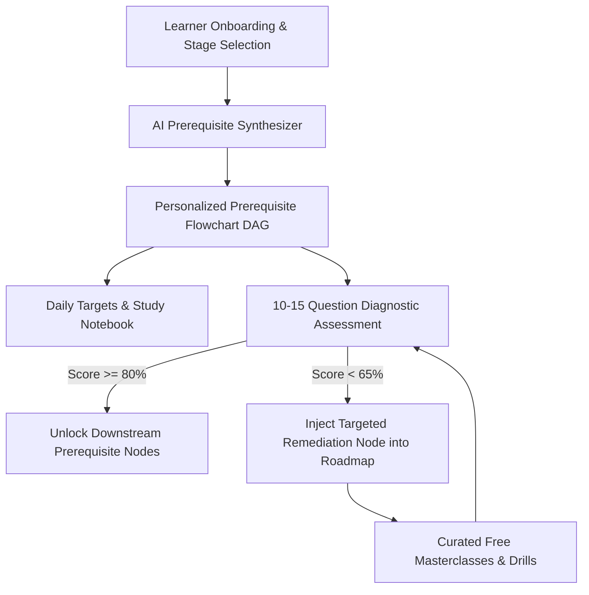

<div align="center">

# 🌌 NEXORA
### **AI-Powered Adaptive Personal Learning Navigator & Prerequisite Graph Engine**

[](https://reactjs.org/)
[](https://www.typescriptlang.org/)
[](https://vitejs.dev/)
[](https://tailwindcss.com/)
[](https://opensource.org/licenses/MIT)

<p align="center">
  <strong>Dynamic Prerequisite Graphs • 10–15 Question Skill-Gap Diagnostics • Tailored Curricula • 100% Free Curated Resources</strong>
</p>

[Explore Features](#-key-features) • [System Architecture](#-system-architecture) • [Getting Started](#-getting-started) • [Target Audiences](#-tailored-learning-tracks)

---

</div>

## 📌 Executive Summary

Most online educational platforms offer **one-size-fits-all, static roadmaps**. When a student struggles with a advanced milestone, traditional systems fail to diagnose *why* they are stuck—often because of an unaddressed **prerequisite knowledge gap** in earlier concepts.

**NEXORA** is an intelligent, personalized learning navigator that models academic and technical mastery as a **Directed Acyclic Graph (DAG)** of interconnected prerequisite nodes. By combining **stage-aware goal onboarding**, **rigorous 10–15 question diagnostic benchmarking**, and **automated real-time remediation**, NEXORA guarantees that every learner progresses at their optimal pace with zero hidden foundation gaps.

---

## 🌟 Key Features

### 1. 🎯 Dynamic Stage-Aware Goal Setup
NEXORA customizes the entire interface, roadmap, and diagnostics based on the learner's exact educational background:
- 🏫 **Class 10th Secondary School**: 95%+ CBSE/State Board mastery, NCERT drills, and early STEM Olympiad foundations.
- 📐 **Class 12 / Junior College**: JEE Main & Advanced (Top 1,000 rank focus), NEET Medical Entrance, and Board PCM/PCB derivations.
- 💻 **B.Tech / Undergraduate**: Software Engineering (SDE) placements, NeetCode 150 Core DSA, System Design, and top tech internships.
- 🚀 **Working Professional / Project Builder**: Full-Stack microservices, production deployment, and career switching.

### 2. 🗺️ Single Clean Interactive Flowchart Roadmap
- **High-Contrast Pure Obsidian UI (`#000000`)**: Zero distractions, crisp typography, and neon status indicators.
- **Node-by-Node Prerequisite Flow**: Visually illustrates prerequisite dependencies (e.g., *Arrays & Hashing ➔ Two Pointers ➔ Binary Search ➔ Trees ➔ Dynamic Programming*).
- **Interactive Problem Drawer**: Includes curated problem checklists, embedded video masterclasses, and verified multi-language solutions (Python, TypeScript, Java, C++).

### 3. 🔬 Rigorous 10–15 Question Diagnostic Skill-Gap Engine
- **Authentic Exam-Level Question Banks**: 10 to 12 in-depth conceptual & analytical questions for every individual topic (Calculus, Rotational Dynamics, Quadratic Equations, Hash Tables, SQL Indexing).
- **Mathematical Skill-Gap Calculation**:
  $$\text{Deficit \%} = 100\% - \text{Score \%}$$
- **Real-Time Automated Remediation**: Scores below 65% instantly insert **Targeted Visual Remediation Nodes** into the active roadmap to bridge foundation deficits before advancing.

### 4. 📚 100% Free Verified Resources & Standard Reference Books
- **JEE & Intermediate**: Disha Publications 45-Year Solved PYQs, HC Verma *Concepts of Physics*, DC Pandey, Mohit Tyagi (*Competishun*), and Physics Galaxy (*Ashish Arora*).
- **Class 10th**: Complete NCERT Exemplar walkthroughs, ray diagrams, and CBSE 5-mark question banks.
- **B.Tech / SDE**: NeetCode DSA roadmaps, MIT OpenCourseWare, CS50, FullStackOpen, and System Design Interview Primers.

### 5. 📓 Interactive Daily Notebook & Habit Streak Tracker
- **One-Click Daily Completion**: Mark *"I Completed Today's Work!"* to celebrate daily sprints and increment study streaks.
- **Session Notes & Formula Vault**: Save key learnings, tricky edge cases, formulas, and mood ratings with automatic `localStorage` persistence.

### 6. 💼 Top Tech Internships & Opportunities Center
- Real-time tracker for Google Summer Internships, Microsoft SWE Intern, Amazon WOW, Atlassian, and Uber.
- Direct eligibility requirement checklist unlocked automatically upon completing Core DSA phases.

---

## 🏗️ System Architecture



---

## 🛠️ Technology Stack

| Layer | Technology |
| :--- | :--- |
| **Frontend Framework** | React 18 with TypeScript |
| **Styling & Design System** | TailwindCSS with custom Pure Black `#000000` Obsidian Theme |
| **Build & Tooling** | Vite 5.x (Lightning-fast HMR & optimized production bundling) |
| **Icons & Visuals** | Lucide React |
| **State & Persistence** | Reactive LocalStorage Engine with cross-session state caching |
| **Visual Elements** | Canvas 3D Constellation Visualizer & Interactive DAG Flowcharts |

---

## 🚀 Getting Started

### Prerequisites
- Node.js (v18.0.0 or higher)
- npm (v9.0.0 or higher) or yarn / pnpm

### Local Installation & Setup

1. **Clone the Repository:**
   ```bash
   git clone https://github.com/Sirivennela310505/NEXORA.git
   cd NEXORA
   ```

2. **Install Dependencies:**
   ```bash
   npm install
   ```

3. **Start the Development Server:**
   ```bash
   npm run dev
   ```
   Open **[http://localhost:5173](http://localhost:5173)** in your browser.

4. **Build for Production:**
   ```bash
   npm run build
   ```

---

## 👥 Tailored Learning Tracks

| Stage | Primary Goals | Key Curricula Included |
| :--- | :--- | :--- |
| **Class 10** | 95%+ Board Scores, Foundation | NCERT Math & Science, Trigonometry, Light & Electricity, Chemical Equations |
| **Class 12 / Inter** | JEE Main/Advanced, NEET | Calculus, Rotational Mechanics, Organic Mechanisms, Disha 45-Yr PYQs, HCV |
| **Undergraduate** | SDE Placements & Internships | NeetCode 150 Core DSA, System Design, SQL B-Trees, Resume Optimizer |
| **Career Switcher** | Full-Stack Project Building | React, Node.js, PostgreSQL, Docker, Microservices, Cloud Deployment |

---

## 📄 License

This project is open-source and licensed under the **MIT License**. See the [LICENSE](LICENSE) file for details.

<div align="center">
  <sub>Built with ❤️ by <strong>Sirivennela</strong> for empowering learners worldwide.</sub>
</div>
